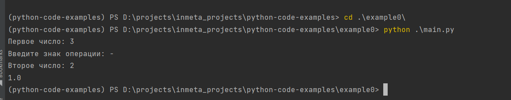

# Примеры работы с импортом модулей в Python.

В примерах начиная от example0 до TODO показано поэтапное разбиение проекта от одного файла с кодом до двух различных python-проектов

Общее описание проекта:

Простейший консольный калькулятор, запрашивающий у пользователя 2 числа и знак арифметической операции, производящейся над ними. После ввода выводит результат операции.

Пример:

